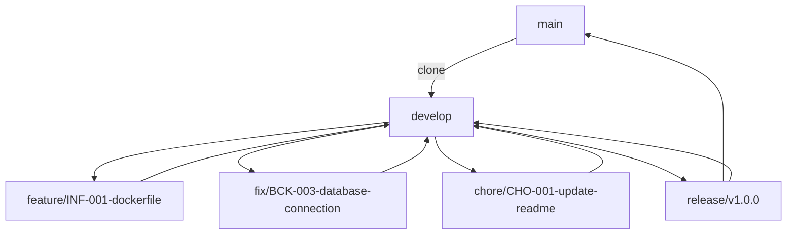

# 💰 Finance# – Personal Finance Management

This project is designed to help individuals maintain the health of their personal finances by providing tools for **budgeting**, **expense tracking**, and **financial planning**.

---

## 🧾 Current version: v0.2.0 (Pre-release)

---

## 🚀 Features

- ✅ Budget management  
- ✅ Expense tracking  
- ✅ Financial goal setting  
- ✅ Reports and analytics

---

## 🛠️ Technologies Used

- .NET 9 (ASP.NET Core MVC)  
- C#  
- Entity Framework Core  
- PostgreSQL  
- pgAdmin  
- Docker  
- Bootstrap 5  
- jQuery  
- Serilog (logging)  
- Centralized Error Handling Middleware + Filters  
- Git + Gitflow  
- Visual Studio 2022 / VS Code  
- Mermaid (for markdown diagrams)

---

## 🧠 TODO Convention & Issue Linking

### ✅ How to name TODOs:
Each TODO task must begin with a prefix indicating the domain it belongs to, followed by a unique number:

| Prefix | Domain                 |
|--------|------------------------|
| INF    | Infrastructure         |
| BCK    | Backend                |
| SRV    | Services               |
| FRT    | Frontend               |
| QA     | Quality                |
| DPS    | DevOps                 |
| CHO    | Chores                 |
| REF    | Refactors              |

**Example:** `INF-001: Create Dockerfile for the ASP.NET Core MVC application`

### 🔗 How to link TODOs to Issues and PRs:
1. Create an issue titled exactly as your TODO item.
2. Reference the issue number in your TODO list:  
   `- [ ] CHO-001: Update README with branch and TODO conventions (#1)`
3. When creating a Pull Request, add `Closes #1` in the **PR description** (not just in commits).

### 🌿 How to name branches from issues:
Use the issue code with a prefix:
- `feature/INF-001-dockerfile`
- `fix/BCK-003-database-connection`
- `chore/CHO-001-update-readme`

---

## 🔖 Release Strategy

### 🗂 Versioning Standard: [SemVer.org](https://semver.org/)
We use semantic versioning to track releases:

```
MAJOR.MINOR.PATCH
```

| Version    | When to use                                              |
|------------|----------------------------------------------------------|
| `0.1.0`    | First pre-release (only boilerplate, no business logic)  |
| `0.2.0`    | Minor changes (structure, docs, setup, test infra)       |
| `1.0.0`    | First stable release with complete core features         |
| `1.1.0`    | Minor features added                                     |
| `1.1.1`    | Patch for bug fixes, no new features                     |

### 🛠 How to Create a Release (Gitflow Style)

> Releases are only made from `main`. Always create a release branch first.

#### 📌 Step-by-step:

```bash
# 1. From develop branch
git checkout develop

# 2. Create a release branch
git checkout -b release/v0.1.0

# 3. Finalize changes (e.g., version bump, docs)
git commit -am "Prepare v0.1.0 release: documentation and structure"
git push origin release/v0.1.0
```

#### ✅ Then:
- Open a Pull Request from `release/v0.1.0` → `main`
- Add `Closes #X` for related issues in the **PR description**
- After merge, **checkout main and tag the release**:

```bash
git checkout main
git pull origin main
git tag -a v0.1.0 -m "Initial pre-release with structure and documentation"
git push origin v0.1.0
```

#### 🚀 Create the GitHub Release

```bash
gh release create v0.1.0 --title "v0.1.0 – Initial Pre-release" --generate-notes --prerelease
```

> ✅ Use `--generate-notes` to automatically pull commit messages and PR titles
> ✅ Use `--prerelease` if the version is not production-ready

#### 🔁 Finally, merge release back into develop:

```bash
git checkout develop
git pull origin develop
git merge main
git push origin develop
```

---

## ✅ TODO

### 🧹 Chores
- [X] CHO-001: Update README with branch and TODO conventions (#1)

### 🔧 Infrastructure
- [X] INF-001: Add `.env.development` file to manage environment variables (#2)
- [ ] INF-002: Add volume for persistent PostgreSQL data (#3)
- [ ] INF-003: Create Dockerfile for the ASP.NET Core MVC application (#4)
- [ ] INF-004: Create `docker-compose.yml` to orchestrate the app + database + pgAdmin (#5)
- [ ] INF-005: Isolate the PostgreSQL container (only accessible by app + pgAdmin) (#6)

### 🧱 Backend
- [ ] BCK-001: Define the project structure (MVC + Services + Persistence) (#7)
- [ ] BCK-002: Create core entities: Transaction, Budget, Category, Goal, User (#8)
- [ ] BCK-003: Create `AppDbContext` and configuration mappings (#9)
- [ ] BCK-004: Create generic repository and specific repositories (#10)
- [ ] BCK-005: Implement a service layer with interfaces and DI setup (#11)
- [ ] BCK-006: Implement centralized error-handling middleware (#12)
- [ ] BCK-007: Implement global exception filters (#13)
- [ ] BCK-008: Set up Serilog for structured logging (#14)
- [ ] BCK-009: Configure connection strings from `.env` files securely (#15)
- [ ] BCK-010: Seed development data in PostgreSQL (optional) (#16)

### 🧩 Application Services
- [ ] SRV-001: Implement `TransactionService`, `BudgetService`, etc. (#17)
- [ ] SRV-002: Add calculation logic for budget remaining and goal progress (#18)
- [ ] SRV-003: Add reporting service for generating summaries (#19)

### 🎨 Frontend (MVC Views)
- [ ] FRT-001: Create base layout and responsive navigation with Bootstrap (#20)
- [ ] FRT-002: Build form pages for creating and listing transactions (#21)
- [ ] FRT-003: Add dynamic charts (e.g., Chart.js) for budget overview (#22)
- [ ] FRT-004: Add interactivity with jQuery and modals for UX (#23)

### 🧪 Quality and DevOps
- [ ] QA-001: Use Gitflow for managing branches (#24)
- [ ] QA-002: Write unit tests for services and repositories (#25)
- [ ] QA-003: Add integration tests for core features (#26)

---

## 🐳 Running with Docker

### 1️⃣ Option 1: Database + pgAdmin only
```bash
# Using development environment variables
docker-compose --env-file .env.development -f docker-compose.yml up postgres pgadmin
```

### 2️⃣ Option 2: Full System (App + DB + pgAdmin)
```bash
# Using development environment variables
docker-compose --env-file .env.development -f docker-compose.yml up --build
```

> 🔐 PostgreSQL is only accessible to the application and pgAdmin containers, and never exposed to the public internet.

---

## 📦 Example .env.development

```env
POSTGRES_DB=finance_dev
POSTGRES_USER=finance_user
POSTGRES_PASSWORD=finance_pass
POSTGRES_PORT=5432
PGADMIN_DEFAULT_EMAIL=admin@finance.local
PGADMIN_DEFAULT_PASSWORD=admin123
PGADMIN_PORT=5050
ASPNETCORE_ENVIRONMENT=Development
ASPNNETCORE_URLS=http://+:5000
DB_HOST=postgres
DB_PORT=5432
DB_NAME=finance_dev
DB_USER=finance_user
DB_PASS=finance_pass
```

> 📁 You can copy this file and rename it to `.env.production` with the appropriate values when preparing for production deployment.

---

## 👨‍💻 Development Workflow

### 📌 Simplified Gitflow Workflow

We use a simplified Gitflow strategy to manage development. Below are the branching details:

#### 1. `main`
- Holds production-ready code.
- Only tested and stable code is merged here.

#### 2. `develop`
- The integration branch for all features and fixes.
- Created from the `main` branch.

#### 3. `feature/<issue-code-description>`
- Used for developing new features.
- Based on the `develop` branch.
- Example: `feature/INF-001-dockerfile`

#### 4. `fix/<issue-code-description>`
- Used for hotfixes or bug fixes.
- Based on the `develop` branch.
- Example: `fix/BCK-003-database-connection`

#### 5. `chore/<issue-code-description>`
- For non-functional changes such as documentation or refactoring.
- Based on the `develop` branch.
- Example: `chore/CHO-001-update-readme`

#### 6. `release/<version>`
- When `develop` is stable and ready for release.
- Merged into both `main` and `develop`.
- Example: `release/v1.0.0`

---

### 📈 Gitflow Diagram



> 💡 *Use [Markdown Preview Mermaid Support](https://marketplace.visualstudio.com/items?itemName=vstirbu.vscode-mermaid-preview) to preview the diagram in VS Code.*

---

## 🧪 Getting Started

```bash
# 1. Clone the repository
git clone https://github.com/rafaelrpd/Finance.git

# 2. Navigate into the project folder
cd Finance

# 3. Checkout the develop branch
git checkout develop
```

---

## 🤝 Contributing

Contributions are welcome!  
Please follow the Gitflow workflow, write clean and tested code, and open Pull Requests targeting the `develop` branch.

---

## 📜 License

This project is licensed under the [MIT License](LICENSE.txt).

---

## 👤 Author

Developed by **Rafael Pereira Dias**.

- 🔗 [LinkedIn](https://www.linkedin.com/in/rafael-dias-rpd/)  
- 🔗 [GitHub](https://github.com/rafaelrpd)

---
